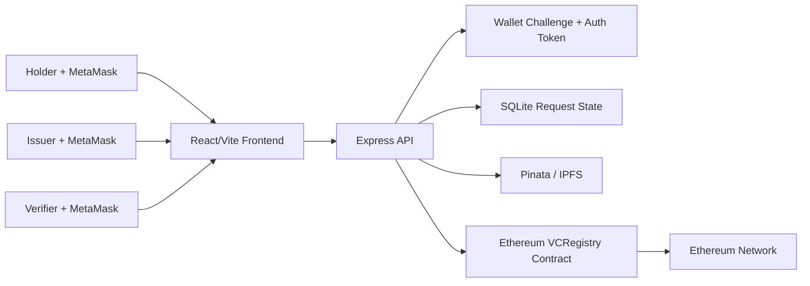

# Decentralized Identity Management System

A full-stack decentralized identity application for issuing, storing, presenting, and verifying verifiable credentials using Ethereum, IPFS, MetaMask, cryptographic hashing, BBS+ signatures, and selective disclosure.

This project demonstrates a DID-based credential workflow where issuers create verifiable credentials, holders manage and selectively disclose credential claims, and verifiers validate credentials and presentations without relying on a centralized identity provider.

## Features

- MetaMask wallet login for holder, issuer, and verifier roles
- Server-issued authentication tokens for protected backend actions
- DID and verifiable credential lifecycle flows
- Ethereum smart contract anchoring for credential references
- IPFS storage through Pinata HTTP APIs
- BBS+ signature support for selective disclosure presentations
- SHA-256 hashing for credential/document integrity checks
- QR-based credential sharing and verification support
- SQLite-backed request/challenge state for local development
- Vite React frontend with Express/Node.js backend

## Tech Stack

| Layer | Technologies |
| --- | --- |
| Frontend | React, Vite, Tailwind CSS, Axios, ethers.js, MetaMask |
| Backend | Node.js, Express, SQLite, Helmet, CORS, rate limiting |
| Blockchain | Solidity, Hardhat, Ethereum/Sepolia, ethers.js |
| Storage | IPFS via Pinata |
| Cryptography | SHA-256, BBS+, BLS12-381-related credential proof concepts |
| Identity | DID, Verifiable Credentials, selective disclosure |

## Architecture



## Repository Structure

```text
.
|-- src/
|   |-- components/          # React role dashboards and credential UI
|   |-- context/             # Auth/theme context providers
|   |-- utils/               # Frontend wallet and storage helpers
|   `-- backend/
|       |-- contracts/       # Solidity smart contracts
|       |-- routes/          # Express API routes
|       |-- scripts/         # Hardhat deployment scripts
|       |-- utils/           # Auth, IPFS, blockchain, BBS+ helpers
|       `-- server.js        # Backend entry point
|-- public/                  # Static frontend assets
|-- index.html               # Vite entry document
|-- vite.config.mjs          # Vite configuration
|-- docker-compose.yml       # Local container orchestration
`-- package.json             # Frontend scripts and dependencies
```

## Prerequisites

- Node.js 20 or newer
- npm
- MetaMask browser extension
- Pinata account and API credentials
- Ethereum RPC provider such as Infura or Alchemy
- Testnet wallet for deployment and blockchain anchoring
- Docker and Docker Compose, optional

## Environment Variables

Create `src/backend/.env`:

```env
PORT=5000
NODE_ENV=development
AUTH_TOKEN_SECRET=replace_with_a_long_random_secret
AUTH_TOKEN_TTL_SECONDS=28800

PINATA_JWT=your_pinata_jwt
# Or use:
# PINATA_API_KEY=your_pinata_api_key
# PINATA_SECRET_API_KEY=your_pinata_secret_api_key
IPFS_GATEWAY_URL=https://gateway.pinata.cloud/ipfs

INFURA_API_KEY=your_infura_key
# Or:
# ALCHEMY_API_KEY=your_alchemy_key

WALLET_PRIVATE_KEY=0x_your_testnet_only_private_key
VC_CONTRACT_ADDRESS=0x_deployed_contract_address
```

Never commit `.env`, private keys, Pinata credentials, JWT secrets, or generated runtime data.

## Installation

Install frontend dependencies:

```bash
npm install
```

Install backend dependencies:

```bash
cd src/backend
npm install
```

## Running Locally

Start the backend:

```bash
cd src/backend
npm start
```

Start the frontend in another terminal:

```bash
npm run dev
```

Default URLs:

- Frontend: `http://localhost:3000` or the Vite-assigned local URL
- Backend: `http://localhost:5000`
- Health check: `http://localhost:5000/health`

## Smart Contract Workflow

Compile contracts:

```bash
cd src/backend
npm run compile
```

Deploy to Sepolia:

```bash
npm run deploy
```

After deployment, copy the printed contract address into `VC_CONTRACT_ADDRESS`.

## Docker

```bash
docker-compose up -d --build
```

MetaMask signing still happens in the browser. The backend does not need, store, or request a user's MetaMask private key.

## Validation

Recommended checks before a release:

```bash
npm audit
npm run build

cd src/backend
npm run compile
npm audit --omit=dev
```

## Security Notes

- Use a testnet-only wallet for contract deployment during development.
- Rotate any credentials that were ever committed or shared.
- Use HTTPS and strict CORS origins in production.
- Set a strong `AUTH_TOKEN_SECRET` in production.
- Keep runtime data, uploads, generated Hardhat artifacts, and build output out of Git.
- Treat selective disclosure presentations as valid only after cryptographic proof verification.
- Review remaining dev-only audit findings before production deployment.

## Roadmap

- Migrate Hardhat 2 tooling to Hardhat 3 or another maintained toolchain
- Add automated backend route tests and frontend integration tests
- Add CI for build, audit, contract compile, and lint checks
- Add production deployment documentation
- Add persistent production database support
- Add formal threat model and key management documentation

## Standards and References

- W3C Decentralized Identifiers (DID)
- W3C Verifiable Credentials Data Model
- BBS+ selective disclosure signature concepts
- Ethereum smart contracts and wallet-based signing
- IPFS content-addressed storage

## License

This project is proposed to be licensed under the MIT License. See `LICENSE`.
